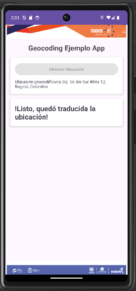

# Resumen de la Aplicación GeocodingEjemplo

Esta aplicación de Android realiza geocodificación inversa para obtener la dirección física correspondiente a una ubicación geográfica obtenida a través del GPS del dispositivo.

| Inicio de la Aplicación                    | Obtención de Ubicación                        | Geocodificación de la Ubicación |
|--------------------------------------------|-----------------------------------------------|---------------------------------|
|  |  |  |

- **Inicio de la Aplicación**: En esta pantalla, el usuario puede iniciar el proceso para obtener la ubicación.
- **Obtención de Ubicación**: Durante este proceso, se muestra un contador mientras se espera la ubicación del dispositivo.
- **Geocodificación de la Ubicación**: Una vez se obtiene la ubicación, se muestra la dirección correspondiente mediante geocodificación inversa.
